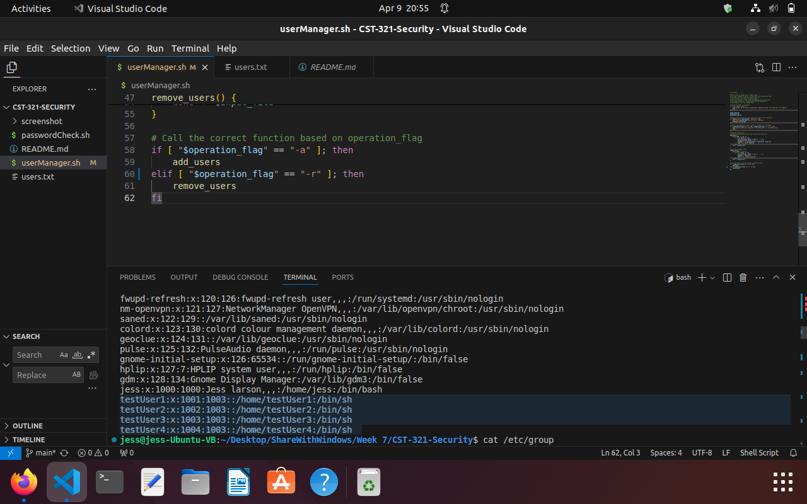

# CST-321-Security

### Buffer Overflow
A buffer overflow occurs when a program writes data beyond the bounds of a buffer.  This is usually in languages like C or C++ where array bounds checking is not performed by default.  For example, the gets() function in C reads the input into a fixed-size buffer without checking the size of the input.  If the input is larger than the buffer size, it overwrites the next memory regions and could corrupt the data or cause the program to crash.  This could be used maliciously to cause denial of service attacks or privilege escalation.  Some ways to prevent this is to check for input size and make sure that it does not exceed the size of the buffer like by using safe string functions such as strcpy_s().  This seems like a simple step and many languages check this automatically at compile time.  
 

Tanenbaum, A. S., and Bos, H. (2023). Modern operating systems (5th ed.). Pearson. ISBN-13: 9780137618842

### Zero-Day Exploit
The zero-day exploit means that there is an unknown issue or vulnerability with software or hardware from the beginning of its release.  If this is found by malicious actors, then it can be used to attach many users or customers until it is fixed, but by then, it is too late.  It is often undetectable to antivirus software because it is unknown.  Once the vulnerability becomes known, there is a race between the security team to fix the issue and the hackers to exploit the vulnerability.  
From a Christian worldview, we need to be outspoken about any issues we notice when developing, testing, or using software or hardware.  God wants us to look out for our fellow people and treat others as we would want to be treated.  No one wants to be taken advantage of simply because they are ignorant.  Many people do not believe (or choose to ignore) God’s word as an authority.  This leads to deciding that the only thing that matters is getting what we want and being happy.  That is dangerous.  If we were to follow God’s laws, there would be a foundational truth of right and wrong.  As Christians, we need to still live by this even if others are not.  

https://www.ibm.com/topics/zero-day

### Kali Linux
Kali Linux is an open-source package with a set of tools for hacking, checking for vulnerabilities, stress testing, and more.  It comes with over 600 tools for various aspects of cybersecurity.  There are comprehensive tutorials and training materials to help users learn how to utilize all of the tools and there are even certification programs available.  There is a real-world simulation for professionals to gain practical experience in a controlled environment. 

Some of the tools that are included in Kali Linux:
| Tool | Description |
| :----: | :----: |
| Nmap | Network scanning tool used for discovering hosts and services|
| Searchsploit | Allows users to search for exploits that are in the Exploit database|
| Dnsenum.pl | Helps get records that are connected to a domain |
| Dnsmap | Finds the phone numbers, contacts, and other data that is connected to the domain |
| LBD | Load balance detector can detect if one server out of multiple is not updated |
| BED | Checks for potential buffer overflows and format strings |
| Fern Wifi Cracker | Can attempt to gain access to vulnerable wifi networks using algorithms, brute force, and dictionary attacks against WEP and WPS |
| Vega | Test the security of web applications including SQL injection flaws |
| Burpsuite | Sniffing tool to find issues with automated scanning |
| Hydra | A password cracking tool that supports many protocols such as SSH, FTP, HTTP, and SMB |
| Powersploit | Allows users to connect with a victim’s machine |
| OllyDbg | Used to reverse engineer Windows applications |
| Dex2Jar | Convert APK file to JAR file in order to view the source code |

https://www.tutorialspoint.com/kali_linux/index.htm

### Bash Shell Password Checker
[PasswordCheck.sh program](./passwordCheck.sh) checks the strength of a password using regex to run 3 tests:
- Minimum length of 8 characters: ```-lt 8```
- At least one number: ```=~ [0-9]```
- At least on special character: ```=~ [@#$%*+=!]```


### Bash Shell Add and Remove Users From Text File
[userManager.sh program](./userManager.sh) is a bash script to manage users. Takes 3 args: an input filename of users, a group name, and an operation flag. The input will be a text file with a list of users to add to or remove from the system. Each line contains a user ID and encrypted password separated by a space character. The passwords are encrypted using openssl with the command line.

Users being added:



Users begin removed:


